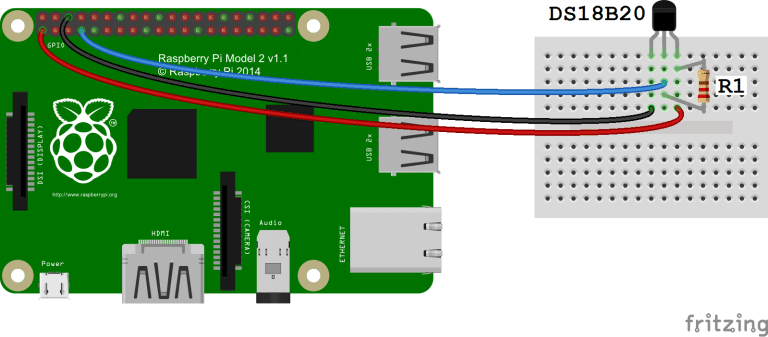

# pi_temperature


A very basic set of scripts for reading a temperature via Raspberry Pi and charting it in a web browser.


## Files

**tempsensor.py** - reads the temperature, saves to a text file with a timestamp

**config.json** - configuration for tempsensor.py and server.py

**server.py** - serves chart and temperature readings to browser

**templates/index.html** - web app

**run_sensor.sh** - will run the ssensor script

**run_server.sh** - runs the web server wiuth gunicorn


## Installation and Usage


### Requirements

- [DS18B20 Digital Temperature Sensor](https://amzn.to/3vyjapy) and associated wiring, circuitry, etc.
- Raspberry Pi 3 B+ - this is what I used. It may work on smaller models with less memory.
- Python 3.x, with the Flask and gunicorn packages. (Run **pip install flask gunicorn** to install them.)

The easiest way to install this is download or check it out from this repository.

### Reading the sensor

Wire the sensor as described [here.](https://www.circuitbasics.com/raspberry-pi-ds18b20-temperature-sensor-tutorial/) 



Here's a summary of the steps required on the nano:

1. Edit /boot/config.txt. Add:
```
dtoverlay=w1-gpio
```
to te bottom of the file.
2. Reboot the Pi.
3. Login and run modprobe.
```
$ sudo modprobe w1-gpio
$ sudo modprobe w1-therm
```
4. Look for the device in ```/sys/bus/w1/devices```. Its directory name will will begin with **28**.

```
pi@yushi:~ $ modprobe w1-gpio
pi@yushi:~ $ modprobe w1-therm
pi@yushi:~ $ cd /sys/bus/w1/devices/
pi@yushi:/sys/bus/w1/devices $ ls
28-3ce1d44421fb  w1_bus_master1
pi@yushi:/sys/bus/w1/devices $ cat 28-3ce1d44421fb/w1_slave
6d 01 55 05 7f a5 a5 66 ef : crc=ef YES
6d 01 55 05 7f a5 a5 66 ef t=22812
pi@yushi:/sys/bus/w1/devices $
```


Configure the script:

```
{
   "interval": "30",
   "readings_file": "readings.txt",
   "decimals": "2",
   "location": "Office"
}
```

**interval** - how frequently to poll the temperarture, in seconds.

**readings_file** - where the readings are stored.

**decimals** - number of figure to keep after the decimal in the temperature.

The script will save the last 24 hours of readings.

Run the **tempsensor.py** script. 

The full command is **python tempsensor.py**. But, there is a shell script **run_sensor.sh** that will run it, too. This command loops, so it will not return the command prompt to you.

It does not need to run with root privileges. It expects to find **config.json** in the current working directory, and will store the readings in its current directory.


### Serving the web page

Run **server.py** as a gunicorn app. See the **run_server.sh** script. 

It expects to see the same configuration file and use it to find the readings, but ti does expect the file with be in its working directory.

Point your web browser at the Raspberry Pi, on port 8000. The page refreshes every few seconds, based on the **interval** setting. It uses **location** for the page title.


